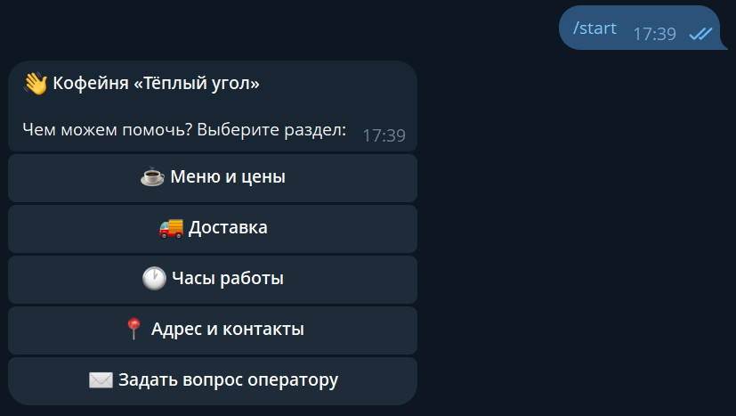
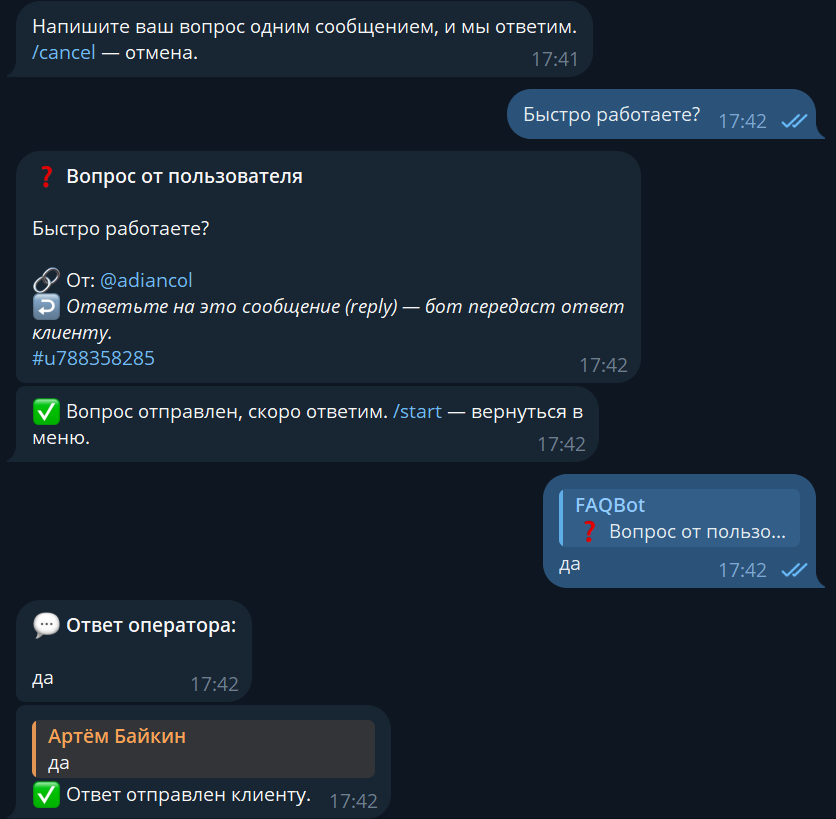

# 📋 Telegram-бот «FAQ / Меню»

Интерактивный бот-меню на инлайн-кнопках: разделы, вложенные подменю, навигация
«Назад» с перелистыванием прямо в одном сообщении и кнопка «Задать вопрос оператору».
Подходит для кафе, услуг, магазинов — как авто-справочная, снимающая типовые вопросы.

&nbsp;

> Проект из портфолио **AdianCol**. Бот развёрнут и работает 24/7.

---

## Задача

Бизнес получает в личку одни и те же вопросы: меню, цены, часы работы, доставка.
Нужен бот, который отвечает на них сам, а сложные вопросы передаёт живому оператору.

## Что сделано

- **Меню на инлайн-кнопках** с вложенными разделами (пример: Меню → Кофе / Выпечка).
- **Навигация «на месте»:** бот редактирует одно сообщение, а не спамит новыми — кнопка «⬅️ Назад» возвращает на уровень выше.
- **Данные отделены от кода:** вся структура и тексты меню вынесены отдельно и меняются под любого клиента без правки логики.
- **«Задать вопрос оператору»:** пользователь пишет вопрос → он уходит оператору с кликабельным контактом.
- **Ответ клиенту через бота:** оператор делает **reply** на уведомление — бот доставляет ответ клиенту от своего имени. Двусторонняя связь без выхода из чата.
- Команды `/start` и `/cancel`, устойчивость к ошибкам.

## Результат

Клиент получает ответы мгновенно и без оператора, а бизнес — меньше рутинных
сообщений. Перенос на другую нишу — это правка одного файла с контентом.

---

## Скриншоты

---

## Возможные доработки под задачу

Кнопки-ссылки (сайт, карта, соцсети), картинки в разделах, поиск по FAQ,
приём заявки/заказа, интеграция с Google Sheets или CRM, аналитика нажатий.

---

## О проекте

Демо из портфолио **AdianCol** — разработка Telegram-ботов, mini-apps и сайтов.
Исходный код приватный, предоставляю по запросу под задачу клиента.

**Связаться:** [Telegram @adiancol](https://t.me/adiancol) · [adiancol.pw](https://adiancol.pw) · artem.baykin13@gmail.com
